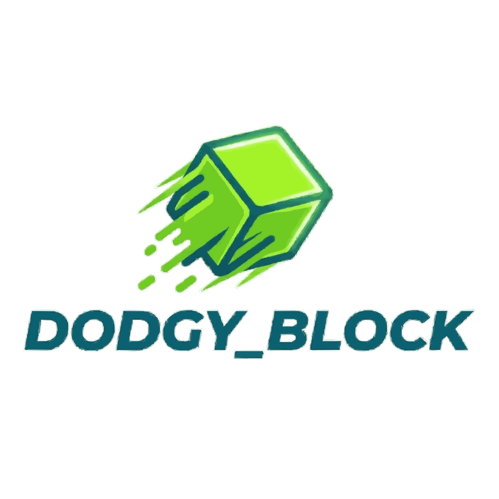

# 🛡️ Dodgy_Block: Data Survival 🕹️

**Dodgy_Block** is a high-octane, browser-based survival arcade game built with a focus on **Realtime Synchronization**, **Identity Security**, and **Anti-Cheat Integrity**. Survive the corruption, dodge the blocks, and claim your spot on the Global Daily Top 10.

<p align="center">
  
</p>

<p align="center">
  <a href="LICENSE"></a>
  <a href="https://github.com/Thenumane218/Dodgy-Block-by-thenumane"></a>
  <a href="https://github.com/Thenumane218/Dodgy-Block-by-thenumane"></a>
  <a href="https://github.com/Thenumane218/Dodgy-Block-by-thenumane/issues"></a>
  <a href="CONTRIBUTING.md"></a>
</p>

---

## 🚀 Live Deployment
**https://dodgyblock.netlify.app/**

---

## 🛠️ Technical Stack
- **Frontend:** Vanilla JavaScript (ES6+), HTML5 Canvas API, CSS3 (Neon-Cyberpunk Aesthetics).
- **Backend-as-a-Service:** [Supabase](https://supabase.com/) (PostgreSQL).
- **Realtime:** WebSockets (via Supabase Realtime) for instant leaderboard updates.
- **Hosting:** Netlify / GitHub Pages.

---

## 🌟 Key Features

### 📡 Realtime Global Leaderboard
The leaderboard isn't just a static list. Using **PostgreSQL Change Data Capture (CDC)**, the UI updates instantly the moment a high score is achieved anywhere in the world. No refresh required.

### 🔐 Secure Identity Uplink
- **Diversity Validation:** Prevents bot-like "AAAAA" registrations by enforcing character diversity checks.
- **Identity Firewall:** Integrated blacklist to prevent prohibited terminology and impersonation (ADMIN/SYSTEM).
- **Persistent Auth:** LocalStorage integration keeps your "Callsign" and "Personal Best" synced across sessions.

### 🛡️ Anti-Cheat Heuristics
The engine monitors the **Score-to-Time Ratio**. If a client attempts to inject a score that is mathematically impossible based on the game's physics, the submission is automatically terminated and flagged.

### 🔄 Daily Reset & Archive Protocol
The network stays competitive through an automated **pg_cron** job. Every 24 hours (00:00 UTC), the Top 10 are moved to a historical archive, and the daily board is cleared for a new cycle of competition.

### 🔊 Retro Audio Engine
A custom Web Audio API implementation generates procedural oscillators for game events, featuring a persistent **Mute Toggle** and a "Victory Chime" for new personal records.

---

## ⚙️ Local Setup

1. **Clone the repository:**
   ```bash
   git clone [https://github.com/your-username/dodgy-block.git](https://github.com/your-username/dodgy-block.git)

2. **Configure Database:**
    Create a config.js in the root folder with your Supabase credentials:
    ```javascript
    window.SUPABASE_URL = "YOUR_SUPABASE_URL";
    window.SUPABASE_ANON_KEY = "YOUR_SUPABASE_ANON_KEY";

3. **Launch:**
Open index.html in any modern browser or use the Live Server extension in VS Code.

4. **🗄️ Database Schema (SQL)**
    ```SQL
    CREATE TABLE leaderboard (
    id UUID PRIMARY KEY DEFAULT uuid_generate_v4(),
    username TEXT UNIQUE NOT NULL,
    password_hash TEXT NOT NULL,
    score INTEGER DEFAULT 0,
    is_verified BOOLEAN DEFAULT false,
    updated_at TIMESTAMP WITH TIME ZONE DEFAULT NOW()
    );

5. **📜 License**
    Project created by thenumane218. Distributed under the MIT License.

